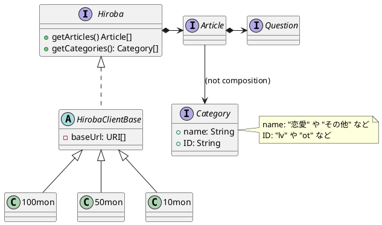

# 質問ひろばのデータを JSON にするやつ

- [100mon.jp](100mon.jp)
- [50mon.jp](50mon.jp)
- [10mon.jp](10mon.jp)

## ER図的なもの

```puml
@startuml

interface Hiroba {
  + getArticles() Article[]
  + getCategories(): Category[]
}
abstract class HirobaClientBase implements Hiroba {
  - baseUrl: URI[] 
}
class 100mon extends HirobaClientBase
class 50mon extends HirobaClientBase
class 10mon extends HirobaClientBase

interface Article {
}

interface Category {
  + name: String
  + ID: String
}
note right
  name: "恋愛" や "その他" など
  ID: "lv" や "ot" など 
end note
interface Question {
}

Hiroba *-> Article
Article *-> Question
Article --> Category: (not composition)
@enduml
```
